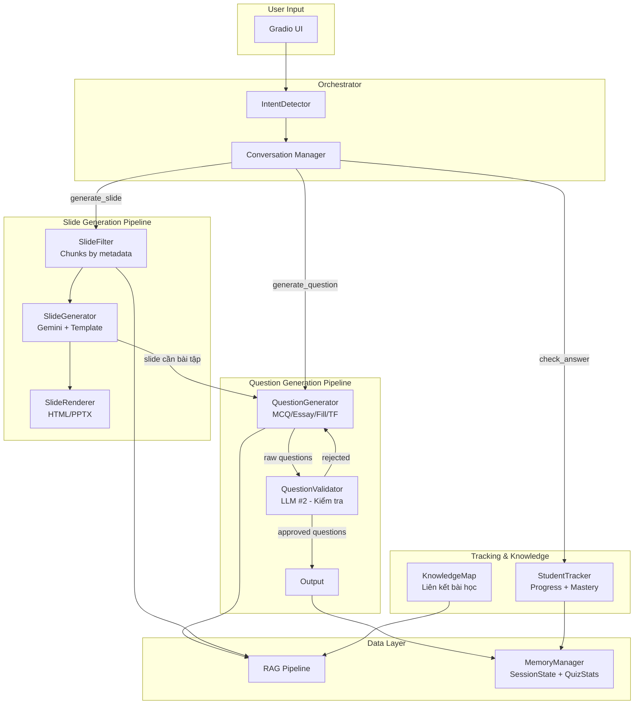
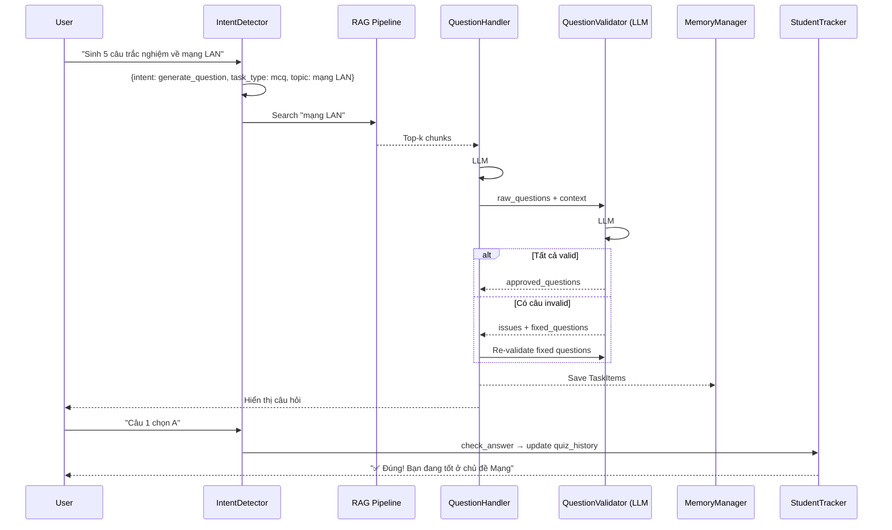
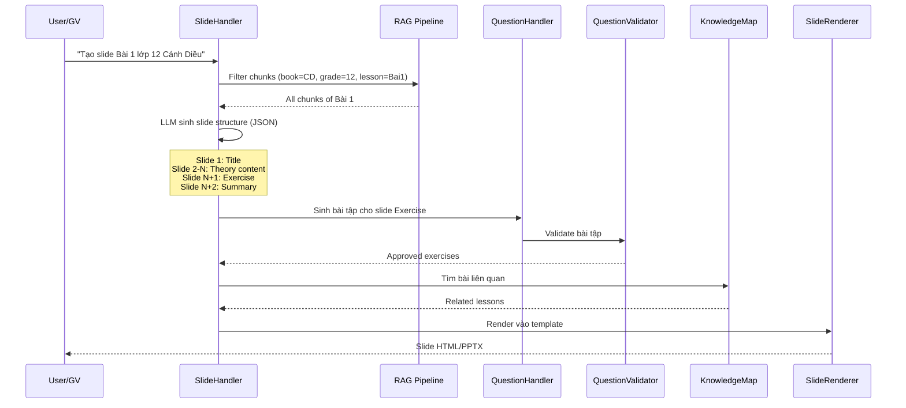

# Phase 2: Question Generation Pipeline + Slide Generation — Thiết kế kiến trúc hệ thống

## Tổng quan

Phase 2 xây dựng 2 chức năng cốt lõi cho hệ thống Educational Chatbot:
1. **Question Generation Pipeline** — Sinh câu hỏi đa dạng + LLM Validator kiểm tra chất lượng + Student Tracking + Knowledge Map
2. **Slide Generation** — Sinh slide bài giảng từ template, tích hợp bài tập (kế thừa Question Generation)

Thiết kế đảm bảo Question Generation là **nền tảng** cho Slide Generation và các tính năng mở rộng sau.

---

## 🏗️ Kiến trúc tổng thể Phase 2



---

## Chức năng 1: Question Generation Pipeline (Ưu tiên #1)

### 1.1 Multi-type Question Generation

Hệ thống hiện tại chỉ có MCQ handler (placeholder). Cần mở rộng để sinh 4 dạng câu hỏi:

| Dạng | Handler | Schema Output |
|------|---------|---------------|
| Trắc nghiệm ABCD | `MCQHandler` | `MCQGenerationOutput` (đã có) |
| Tự luận | `EssayHandler` | `EssayGenerationOutput` (mới) |
| Đục lỗ / Điền khuyết | `FillBlankHandler` | `FillBlankGenerationOutput` (mới) |
| Đúng/Sai | `TrueFalseHandler` (mới) | `TrueFalseGenerationOutput` (mới) |

**Flow chung cho mọi dạng:**
```
User query → IntentDetector → {task_type: "mcq"|"essay"|"fill_blank"|"true_false"}
    ↓
RAG Search → Context chunks
    ↓
[MCQ|Essay|Fill|TF]Handler.generate(query, context)
    ↓
Raw questions (JSON)
    ↓
QuestionValidator.validate(questions, context)  ← LLM #2
    ↓
Approved? → Output to user + Save to MemoryManager
Rejected? → Re-generate hoặc fix + validate lại (max 2 retries)
```

### 1.2 Question Validator (LLM kiểm tra — QUAN TRỌNG)

> [!IMPORTANT]
> Đây là node LLM thứ 2, **chuyên kiểm tra chất lượng** câu hỏi trước khi đưa ra user. Không dùng chung model/prompt với node sinh câu hỏi.

**Mục đích:** Kiểm tra tính đúng đắn của:
- Kiến thức trong câu hỏi (có khớp context không?)
- Đáp án đúng (correct_answer có thực sự đúng không?)
- Giải thích / explanation (có logic không?)
- Các phương án nhiễu (có hợp lý, không quá dễ loại trừ?)
- Format (đủ options, không trùng lặp, ...)

**Thiết kế:**

```python
# src/llm/validators/question_validator.py

class QuestionValidator(BaseHandler):
    """
    LLM Node #2 — Kiểm tra chất lượng câu hỏi đã sinh.
    
    Input:  List[question] + context (từ RAG)
    Output: ValidationResult {approved, issues, fixed_questions}
    """
    
    def validate(self, questions: list, context: str, question_type: str) -> ValidationResult:
        """
        Gửi câu hỏi + context cho LLM kiểm tra.
        LLM sẽ:
        1. Đối chiếu kiến thức câu hỏi với context
        2. Verify đáp án đúng
        3. Đánh giá chất lượng phương án nhiễu
        4. Trả về danh sách issues và câu hỏi đã sửa (nếu có)
        """
        ...
    
    def validate_with_retry(self, handler, query, context, max_retries=2) -> list:
        """
        Loop: generate → validate → nếu fail thì re-generate.
        Tối đa max_retries lần.
        """
        ...
```

**Schema:**
```python
# Thêm vào src/schemas/llm_outputs.py

class QuestionValidation(BaseModel):
    """Kết quả validate 1 câu hỏi."""
    index: int
    is_valid: bool
    issues: List[str] = []           # ["Đáp án sai", "Kiến thức không có trong context"]
    fixed_question: Optional[dict]    # Câu hỏi đã sửa (nếu validator tự sửa được)

class ValidationResult(BaseModel):
    """Kết quả validate toàn bộ batch."""
    all_valid: bool
    validations: List[QuestionValidation]
    approved_questions: List[dict]    # Câu hỏi đã pass
```

### 1.3 Student Tracking & Progress (In-Memory)

> [!NOTE]
> Không cần login/database. Tracking **trong SessionState** — mỗi conversation Gradio = 1 session tự động.

**Mở rộng SessionState (trong `memory.py`):**
```python
@dataclass
class SessionState:
    # ... fields cũ ...
    quiz_stats: QuizStats = field(default_factory=QuizStats)

@dataclass
class QuizStats:
    total_questions: int = 0
    correct_answers: int = 0
    by_topic: Dict[str, TopicStats] = field(default_factory=dict)
    by_type: Dict[str, int] = field(default_factory=dict)  # {"mcq": 5, "essay": 2}

@dataclass
class TopicStats:
    total: int = 0
    correct: int = 0
    accuracy: float = 0.0
```

**StudentTracker** là class helper tính toán stats từ `SessionState`:
```python
# src/llm/tracking/student_tracker.py

class StudentTracker:
    def update(self, session: SessionState, answer_result: dict): ...
    def get_weak_topics(self, session: SessionState) -> List[str]: ...
    def suggest_review(self, session: SessionState) -> str: ...
    def get_summary(self, session: SessionState) -> str: ...
```

**Lưu trữ:** In-memory trong `SessionState` → data tồn tại trong conversation, mất khi đóng tab.

### 1.4 Knowledge Map (Liên kết bài học)

```python
# src/llm/tracking/knowledge_map.py

class KnowledgeMap:
    """
    Xây dựng graph liên kết giữa các bài học.
    
    3 loại liên kết:
    1. same_topic:   Cùng topic_name (VD: "Mạng máy tính" ở CD-10, CD-12, KNTT-10)
    2. sequential:   Cùng sách, lesson liền kề (prerequisite/next)
    3. cross_ref:    LLM phát hiện bài A tham chiếu kiến thức bài B
    """
    
    def build_from_chunks(self, chunks: list) -> dict:
        """Xây graph tự động từ metadata chunks."""
        ...
    
    def get_related_lessons(self, lesson_id: str) -> List[dict]:
        """Tìm bài liên quan khi user hỏi."""
        ...
    
    def detect_prerequisites(self, chunk_content: str, context: str) -> List[str]:
        """Dùng LLM phát hiện kiến thức chưa học."""
        ...
```

**Ứng dụng trong Question Pipeline:**
- Khi sinh câu hỏi bài A, nếu context đề cập kiến thức bài B mà user chưa học → cảnh báo: "Câu hỏi này liên quan đến Bài B, bạn đã học chưa?"
- Gợi ý ôn tập based on Knowledge Map + Student Tracking

---

## Chức năng 2: Slide Generation (Ưu tiên #2 — Thầy khuyến khích)

### 2.1 Flow tổng thể

```
GV chọn: Bộ sách + Lớp + Bài
    ↓
SlideFilter: Filter chunks by metadata → ALL chunks của bài
    ↓
SlideGenerator: Gemini sinh slide structure (JSON)
    ├── Slide 1: Tiêu đề + Mục tiêu bài học
    ├── Slide 2-N: Nội dung chính (map theo chunk type=theory)
    ├── Slide N+1: Ví dụ + Minh họa
    ├── Slide N+2: BÀI TẬP ← kế thừa Question Generation Pipeline
    │   └── QuestionGenerator.generate() + QuestionValidator.validate()
    └── Slide cuối: Tóm tắt + Kiến thức liên quan (Knowledge Map)
    ↓
SlideRenderer: JSON → Template → HTML/PPTX
```

### 2.2 Template System

```python
# src/llm/handlers/content/slide_template.py

class SlideTemplate:
    """
    Quản lý template slide.
    
    User có thể cung cấp template PPTX/HTML sẵn,
    hệ thống map nội dung vào template đó.
    """
    
    SLIDE_TYPES = {
        "title":    {"layout": "title_slide", "fields": ["title", "subtitle"]},
        "content":  {"layout": "content_slide", "fields": ["title", "bullets", "notes"]},
        "exercise": {"layout": "exercise_slide", "fields": ["questions"]},
        "summary":  {"layout": "summary_slide", "fields": ["key_points", "related_lessons"]},
    }
    
    def load_template(self, template_path: str) -> dict:
        """Load PPTX/HTML template, parse layout slots."""
        ...
    
    def render(self, slides_data: list, template: dict) -> str:
        """Render slide data vào template → output file."""
        ...
```

### 2.3 SlideGenerator (chính)

```python
# src/llm/handlers/content/slide_handler.py  (sửa placeholder hiện tại)

class SlideHandler(BaseHandler):
    """
    Sinh slide bài giảng hoàn chỉnh.
    
    Kết hợp:
    - RAG chunks (filtered by lesson metadata)
    - Question Generation Pipeline (cho slide bài tập)
    - Knowledge Map (cho slide liên kết)
    """
    
    def handle(self, query: str, **kwargs):
        """
        Input: query chứa thông tin bài (book, grade, lesson)
        Output: SlideGenerationOutput (JSON list slides)
        """
        # 1. Filter chunks by metadata
        chunks = self._filter_chunks(kwargs.get("metadata"))
        
        # 2. Gọi LLM sinh slide structure
        slides = self._generate_structure(chunks)
        
        # 3. Sinh bài tập cho slide exercise (kế thừa Question Pipeline)
        slides = self._inject_exercises(slides, chunks)
        
        # 4. Thêm kiến thức liên quan (Knowledge Map)
        slides = self._inject_related(slides, kwargs.get("knowledge_map"))
        
        # 5. Render vào template (nếu có)
        return self._render(slides, kwargs.get("template"))
```

**Schema:**
```python
# Thêm vào src/schemas/llm_outputs.py

class SlideItem(BaseModel):
    slide_type: Literal["title", "content", "exercise", "image", "summary"]
    title: str
    bullets: List[str] = []
    notes: Optional[str] = None
    questions: Optional[List[dict]] = None    # Cho slide exercise
    related_lessons: Optional[List[str]] = None  # Cho slide summary

class SlideGenerationOutput(BaseModel):
    lesson_title: str
    lesson_metadata: dict      # {book, grade, lesson}
    slides: List[SlideItem]
    total_slides: int
```

---

## 📁 Cấu trúc files mới/sửa

### Files MỚI

| File | Mô tả |
|------|--------|
| `src/llm/validators/__init__.py` | Package validators |
| `src/llm/validators/question_validator.py` | LLM Node #2 — kiểm tra câu hỏi |
| `src/llm/tracking/__init__.py` | Package tracking |
| `src/llm/tracking/student_tracker.py` | Tracking progress + mastery |
| `src/llm/tracking/knowledge_map.py` | Liên kết bài học |
| `src/llm/handlers/content/slide_template.py` | Template system cho slide |
| `src/llm/handlers/question/true_false_handler.py` | Handler dạng Đúng/Sai |
| `src/prompts/question_prompts.py` | Prompt templates cho 4 dạng câu hỏi |
| `src/prompts/validator_prompts.py` | Prompt cho QuestionValidator |
| `src/prompts/slide_prompts.py` | Prompt cho SlideGenerator |
| `data/knowledge_map.json` | Pre-built knowledge graph |

### Files SỬA

| File | Thay đổi |
|------|----------|
| `src/schemas/llm_outputs.py` | Thêm schemas: Essay, FillBlank, TrueFalse, Validation, Slide |
| `src/llm/handlers/question/mcq_handler.py` | Migrate logic từ `question_handler.py` cũ |
| `src/llm/handlers/question/essay_handler.py` | Implement handler tự luận |
| `src/llm/handlers/question/fill_handler.py` | Implement handler đục lỗ |
| `src/llm/handlers/question/scorer.py` | Hỗ trợ scoring cho mọi dạng |
| `src/llm/handlers/content/slide_handler.py` | Implement đầy đủ |
| `src/llm/memory.py` | Thêm tracking fields vào SessionState |
| `src/llm/conversation.py` | Refactor → dùng IntentDetector + new handlers |
| `src/llm/intent_detector.py` | Cập nhật prompt cho task_types mới |
| `plan.md` | Cập nhật Phase 2 roadmap |

---

## 🔄 Data Flow chi tiết

### Flow 1: Sinh câu hỏi với Validation



### Flow 2: Sinh Slide (kế thừa Question Pipeline)



---

## 📊 Thứ tự triển khai đề xuất

| Bước | Task | Phụ thuộc | Ước lượng |
|------|------|-----------|-----------|
| 1 | **Schemas mới** (Essay, Fill, TF, Validation, Slide) | Không | 1 ngày |
| 2 | **Prompt templates** (4 dạng câu hỏi + validator + slide) | Bước 1 | 1 ngày |
| 3 | **MCQHandler** migrate logic từ handler cũ | Bước 1-2 | 0.5 ngày |
| 4 | **EssayHandler + FillHandler + TrueFalseHandler** | Bước 1-2 | 1 ngày |
| 5 | **QuestionValidator** (LLM #2) | Bước 3-4 | 1.5 ngày |
| 6 | **StudentTracker** + StudentProfile | Bước 5 | 1 ngày |
| 7 | **KnowledgeMap** (build graph từ chunks) | Không | 1 ngày |
| 8 | **SlideHandler** + SlideTemplate | Bước 5, 7 | 2 ngày |
| 9 | **Conversation refactor** (IntentDetector + new handlers) | Bước 5, 8 | 1 ngày |
| 10 | **Integration test** + cập nhật Gradio UI | Bước 9 | 1 ngày |

**Tổng ước lượng: ~11 ngày**

---

## Verification Plan

### Automated Tests

Chưa có test framework (chỉ có `test.ipynb`). Đề xuất:

1. **Unit test schemas**: Validate Pydantic schemas với edge cases
   ```
   python -m pytest tests/test_schemas.py -v
   ```

2. **Integration test Question Pipeline** (notebook):
   ```
   Chạy src/notebook/test_question_pipeline.ipynb
   ```
   - Test sinh MCQ + validate → check output format
   - Test sinh Essay + validate
   - Test case: câu hỏi sai kiến thức → validator bắt được

3. **Integration test Slide Pipeline** (notebook):
   ```
   Chạy src/notebook/test_slide_pipeline.ipynb
   ```
   - Input: Bài 1 CD lớp 12 → output slide JSON/HTML
   - Kiểm tra slide có bài tập (questions not null)
   - Kiểm tra bài tập đã qua validation

### Manual Verification

1. **Test qua Gradio UI** (`python app_gradio.py`):
   - Nhập "Sinh 3 câu trắc nghiệm về mạng máy tính" → verify format + đáp án đúng
   - Nhập "Tạo slide Bài 1 lớp 12 Cánh Diều" → verify slide output có bài tập
   - Trả lời câu hỏi → verify Student Tracker cập nhật

> [!NOTE]
> Verification chi tiết sẽ được update khi implement từng bước. Plan này là tổng quan cho toàn bộ Phase 2.
